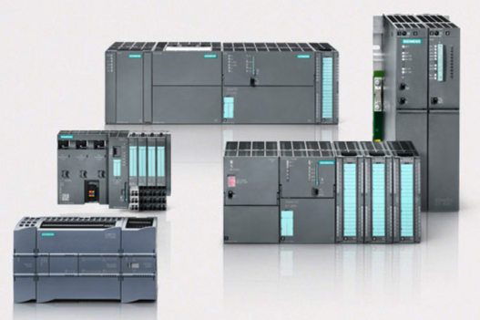
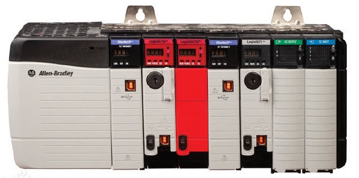
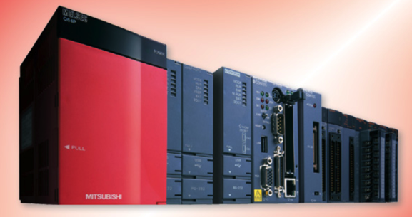
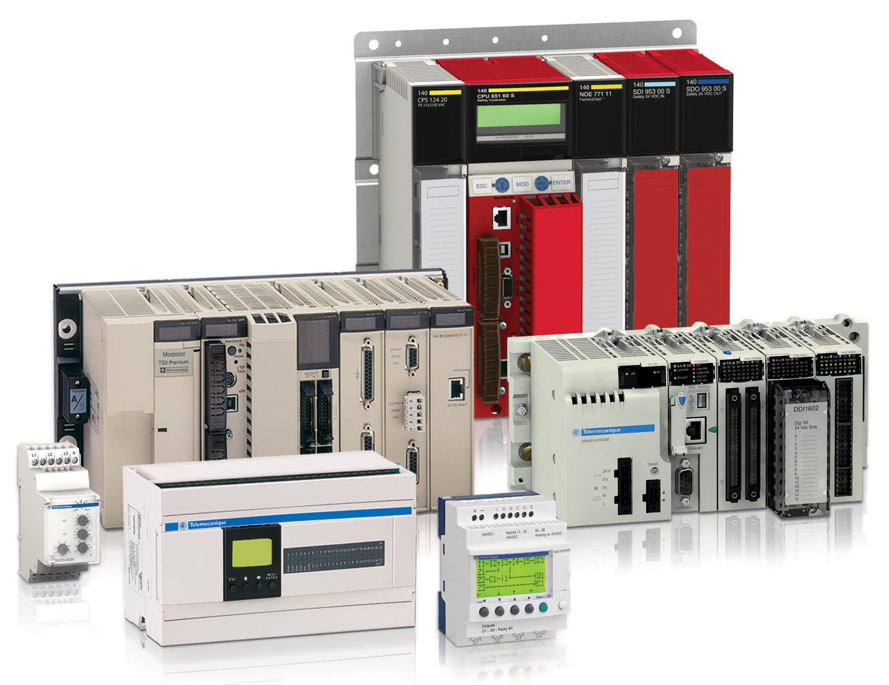
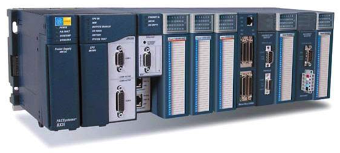
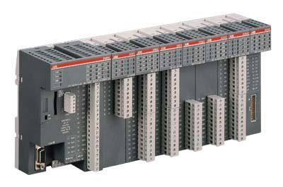

# PLC厂商

常见PLC厂商：

* 总体概况
  * 总数
    * 300多PLC生产厂家
    * 500多种PLC产品
  * 主要品牌区域和市占率
    * 主要品牌区域：美国、欧洲、日本
      * 总市场份额： >60%
* 国外：
  * 前三品牌
    * 德国
      * Siemens西门子
        * SIMATIC S7
          * 
    * 美国
      * Rockwell罗克韦尔
        * AB(Allen-Bradley)的ContorlLogix
          * 
    * 日本
      * Mitsubishi三菱
        * Q系列 / FX3G系列
          * 
  * 其他常见品牌
    * 德国
      * Schneider施耐德
        * Modicon Quantum
          * 
    * 日本
      * Omron欧姆龙
      * Panasonic松下
    * 美国
      * Emerson艾默生
      * GE=General Electric
        * GE Fanuc PLC
          * 
    * 瑞士
      * ABB
        * ABB 40及50系列
          * 
    * 韩国
      * LG的LS自动化
  * 小众品牌
    * 富士
    * 霍尼韦尔Honeywell
    * WAGO万可
* 国内
  * 和利时
  * 台达
  * 汇川
  * 合信
  * 深圳亿维
  * 南大傲拓
  * 德维森
  * 科威
  * 信捷
