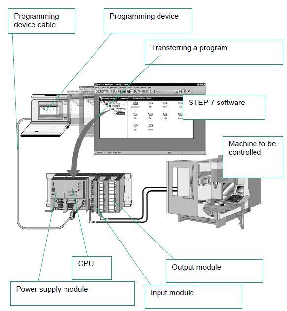

# PLC开发

下面介绍，作为PLC的研发人员，如何开发PLC。

## PLC研发人员典型工作状态

* 工作区域
  * 30%时间 在 办公室：写PLC代码
    * TODO：博士的办公室的照片
  * 60%时间 在 自己公司的生成线：调试PLC代码
    * TODO：加 博士的火花塞的生产线的厂房照片
  * 10%时间 在 客户的生产线：调试和确保PLC代码正常工作，生产线流水线顺利生产
    * TOOD：加 无锡博士生产线的照片

## PLC系统中，PLC编程人员如何下载代码到PLC硬件中

PLC编程人员，在电脑编写好PLC代码后，通过电缆把电脑连接到PLC上，然后下载代码到PLC硬件中：

即：

* 电脑：编程设备
* 人：用电脑写PLC代码的人
* 电脑连接PLC：用电缆
* PLC：下载到PLC的CPU中
