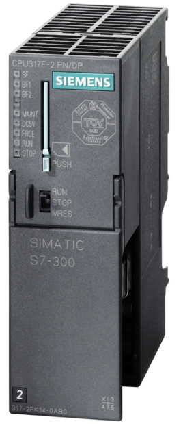
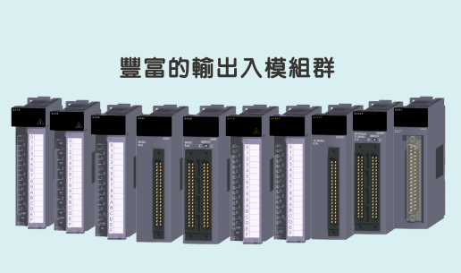
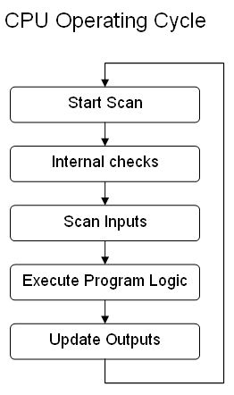

# PLC简介

## PLC是什么

* =`Programmable Logic Controller`=`可编程逻辑控制器`
  * 为何叫PLC=可编程逻辑控制器
    * 因为早期的PLC
      * 用简易之逻辑开/关实现硬件的继电器开关
        * 算是：**可编程**
      * 只能进行逻辑运算
        * 所以叫：**逻辑**
      * 从而可以实现控制功能
        * 谓之：**控制器**
  * 名词含义详解
    * **可编程**：可以通过软件上的写代码控制
      * 之前是：用硬件实现逻辑控制
        * 继电器relay
        * 定时器timer
        * 定序器sequencer
        * 接触器contactor
      * 替代了：
        * 机械开关装置
        * 继电器控制板
      * 作用总结：
        * 用软件实现硬件的逻辑控制
    * **逻辑**：根据业务上的逻辑
    * **控制器**：控制外部硬件设备工作
      * 往往是让硬件运动
        * 比如：
          * 机械
          * 机床
          * 机器人
          * 电梯
      * 所以又称：
        * `PLC控制器`

### 硬件上

* 狭义：一种专用的CPU
  * 专门用于自动化控制设备
    * 和其他普通CPU的关系可参考：
      * [芯片名词对比 · 芯片产业链总结](https://book.crifan.com/books/ic_chip_industry_chain_summary/website/ic_chip_summary/chip_names_compare.html)
    * 举例
      * 
* 广义：整套PLC组件
  * = PLC的CPU模块 + 其他各种模块
    * 为啥：因为目的是控制外部设备，所以要有众多的其他输入输出的模块
      * 

### 软件上

* 针对PLC硬件的软件，即PLC编程语言
  * 所以也叫：`PLC语言`

## PLC用来干啥

* 控制设备
  * 通过输入接口输入信号
  * 内部处理后
    * 根据程序代码的逻辑
  * 输出接口输出信号
    * 用于控制外部设备的运动

## PLC和我有什么关系

* 普通用户：没啥直接关系，但是你可以课外知识了解一下：
  * 你用的手机、汽车等很多设备，往往都是工厂的生产线生产的，生产线中用于控制各种机械运动的核心设备之一，就是PLC
    * 举例：
      * 很多汽车里的火花塞的生产线，就是用的博士力士乐的PLC
* 技术开发人员
  * 互联网等纯软件开发人员：基本没啥关系，你后半生基本不会遇到
  * 嵌入式软件研发人员：一般很少基础到
    * 除非偶尔涉及到自动化产线，或许会有所接触和了解，但是也不需要去PLC编程
  * 自动化控制软件人员：如果是专门做PLC的，那么就要懂相关领域和具体编程了

## PLC基本工作原理

## 和PLC相关的概念

* `DCS`=`Distributed Control System`=`集散控制系统`=`分布式控制系统`
* `FCS`=`Fieldbus Control System`=`现场总线控制系统`
