# PLC长啥样

## 单个PLC（的CPU）模块

* Siemens西门子
  * 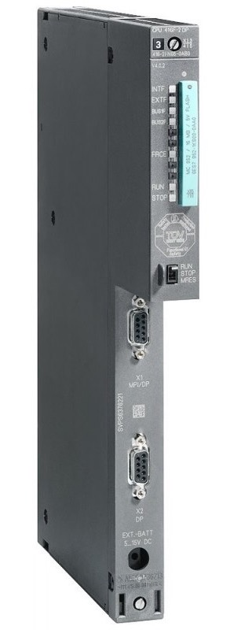
* Mitsubishi三菱
  * 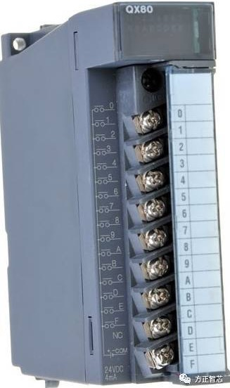

## 实际使用的PLC都是模块组合或成套的

* PLC的CPU模块 + 电源模块
  * 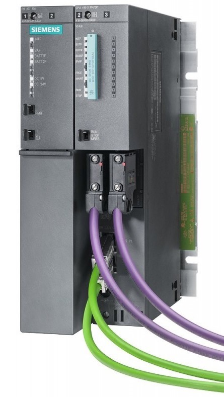

### 单个整套PLC：CPU加上其他模块：电源等，输入模块，输出模块等

* 逻辑上的典型结构示意图
  * 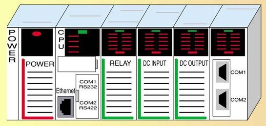
* 举例
  * 西门子
    * 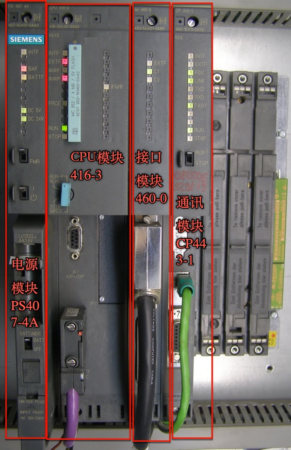
      * 各个成套的系列
        * 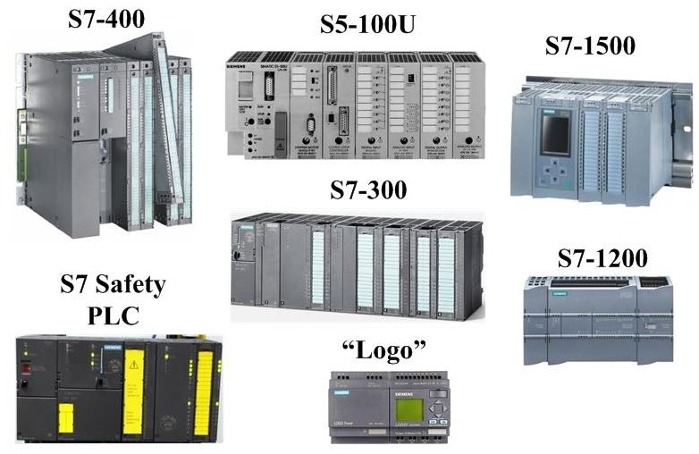
  * 三菱
    * 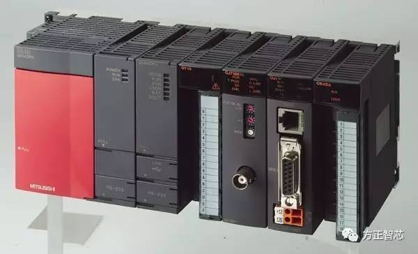

### 简单的：PLC演示系统

用于教学和演示的小系统

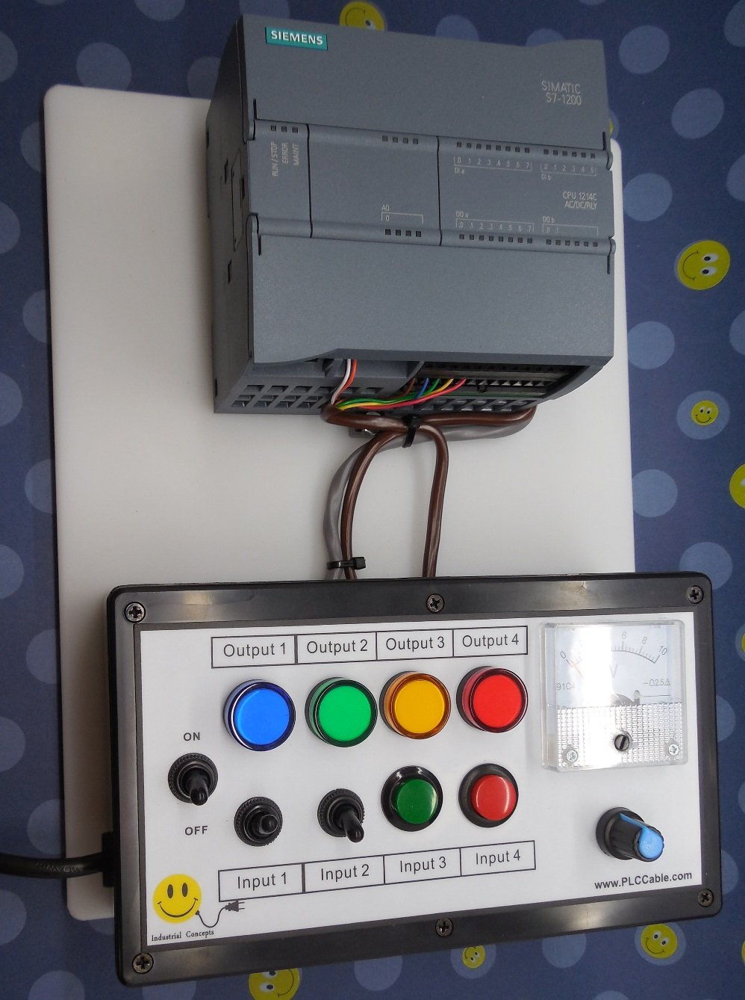

### 复杂的：真实系统

生产线中电气柜中的PLC（加上各种模块和连线后）是这种

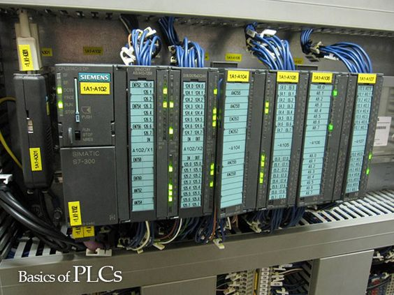

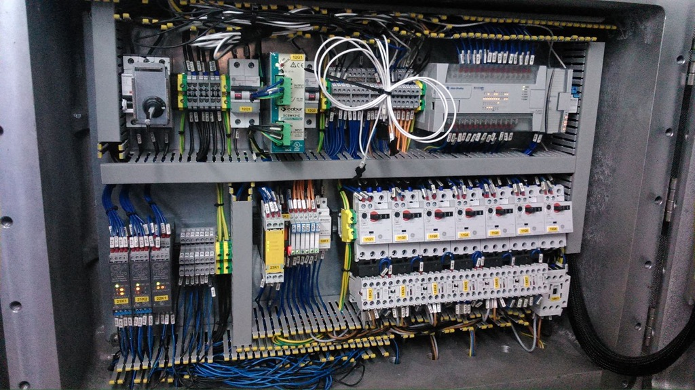

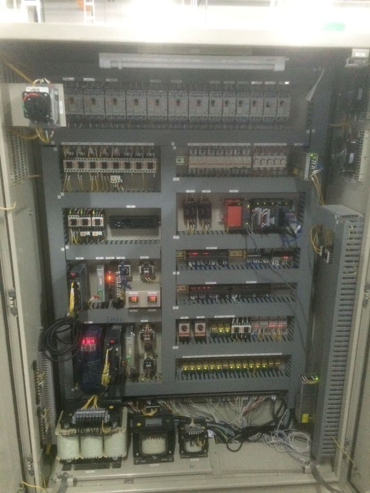
