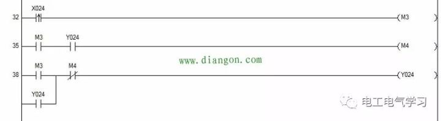
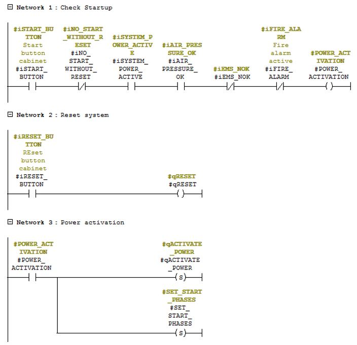
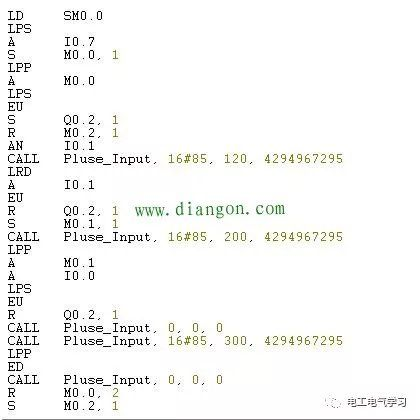
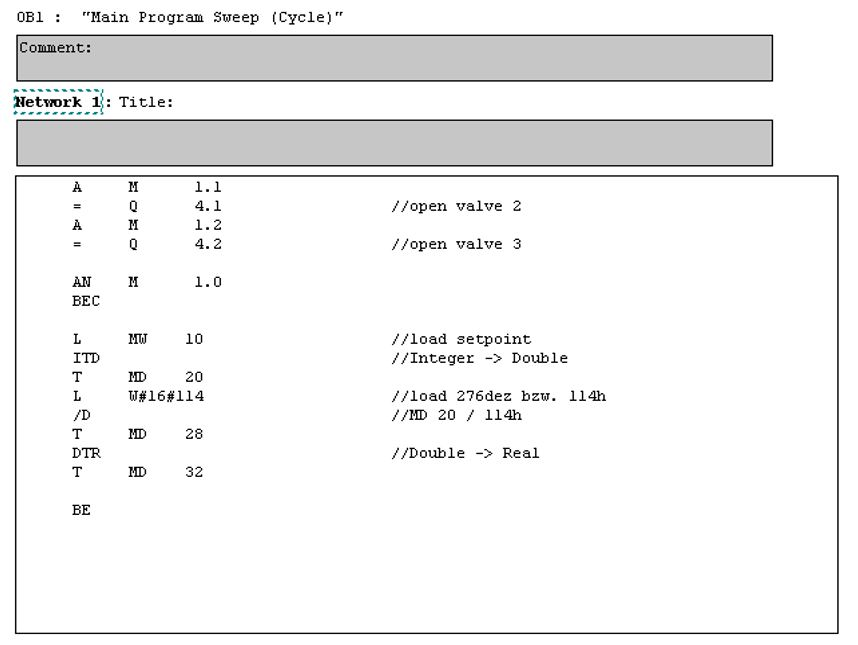
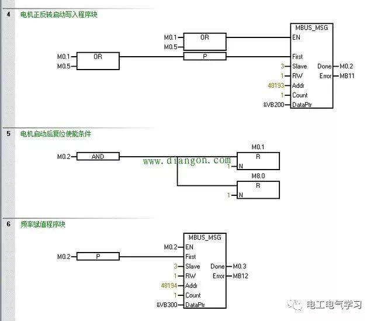
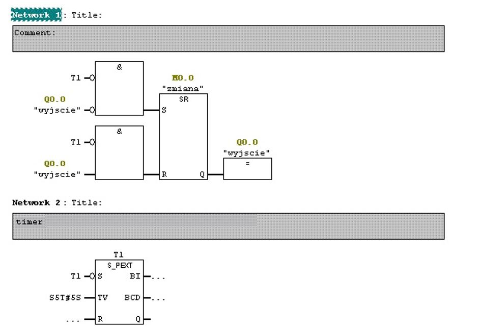
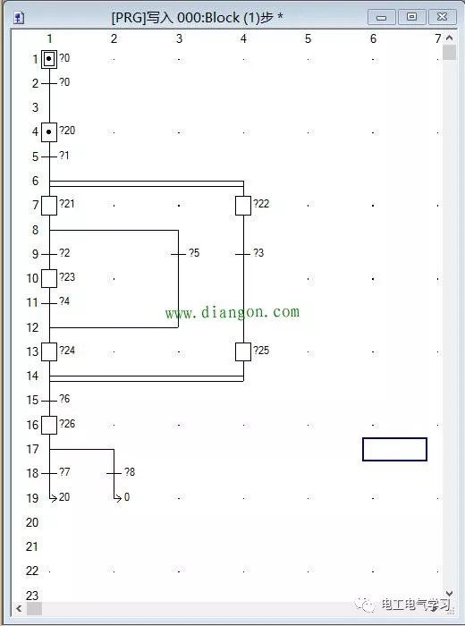
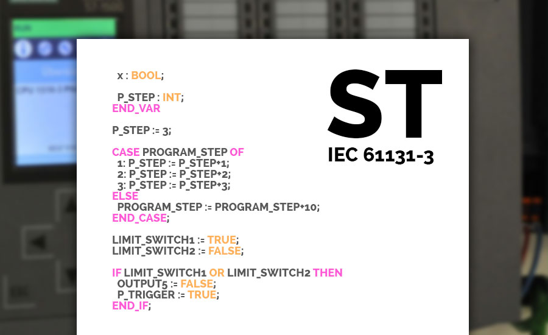
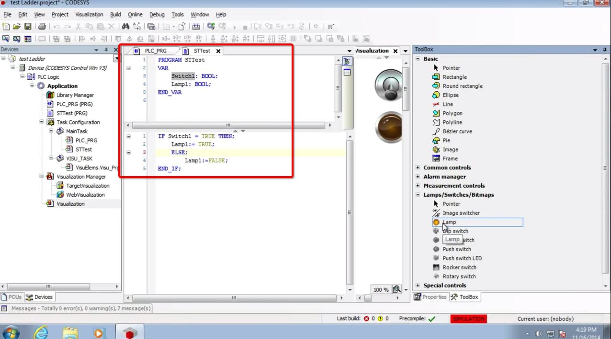
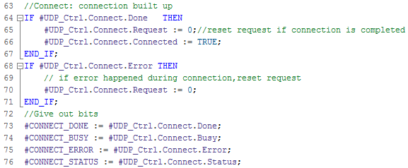

# PLC语言

PLC语言种类主要有：

* 梯形图=LD=Ladder Diagram
  * 举例：
    * 
    * 
* 指令表=IL=Instruction List
  * 举例：
    * 
    * 
* 功能模块图=FBD=Function Block Diagram
  * 举例：
    * 
    * 
* 顺序功能流程图=SFC=Sequential Function Charts
  * 举例：
    * 
* 结构化文本=ST=Structured Text=（典型的计算机）编程语言
  * 含义：用结构化的描述文本来描述程序的一种编程语言
    * 它是类似于高级语言的一种编程语言
  * 特点：
    * 采用高级语言进行编程，可以完成较为复杂的控制运算
      * 在大中型PLC系统中，常采用结构化文本来描述控制系统中各个变量的关系,完成所需的功能或操作
    * 要求较高，需要有一定的计算机高级语言的知识和编程技巧
    * 因为直观性和操作性较差，常用于其他编程语言较难实现的用户程序编制
  * 举例：
    * 
    * 

其他一些特有的PLC语言：

* 西门子的SCL
  * =Structured Control Language=结构化控制语言
  * 介绍
    * 基于PASCAL
    * 除了编程语言的基础特点外，还提供了基本指令、扩展指令、工艺指令及通信指令等丰富的指令
      * 满足所有PLC控制的要求
  * 举例
    * 
