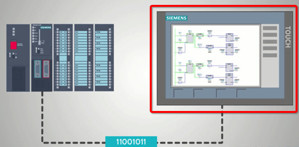
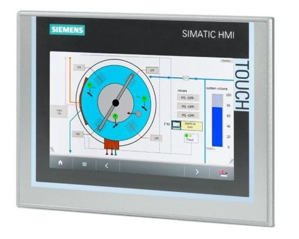
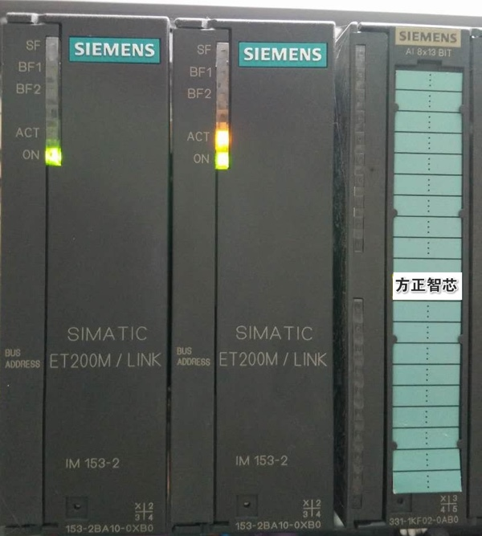

# PLC领域内概念

PCL领域常见名字和概念

* 组态
  * =Configuration
  * 之前的背景
    * 实现一定的功能，都是软件代码慢慢写出来的
      * 缺点：工作量大，周期长，容易出错
  * 现在：
    * 软件功能模块化
      * 要实现一定的功能，像搭积木一样，把各个功能模块，组装、配置出一套系统，用于实现特定的功能
  * 主要指的是：工业控制领域内的软件组态
    * 类似于硬件中的用各个配件和模块组装出电脑
* HMI
  * =Human Machine Interface=人机交互界面
  * 看起来：相当于一个显示器
  * 功能：是一个操作控制的面板
  * 长什么样：
    * 大体样子
      * 
    * 真实样子
      * 
      * TODO：博士的力士乐的控制面板的照片
* 下载
  * 把PC中写好的PLC代码，写入/烧录，到PLC硬件中
* 冗余
  * 生产线停机造成损失会非常大
    * 为了不停机，所用到的PLC等控制系统，往往要有额外的备份，叫做冗余
    * 包括部署时，甚至会多部署一套
      * 举例
        * 西门子IM 153-2冗余系统
          * 
